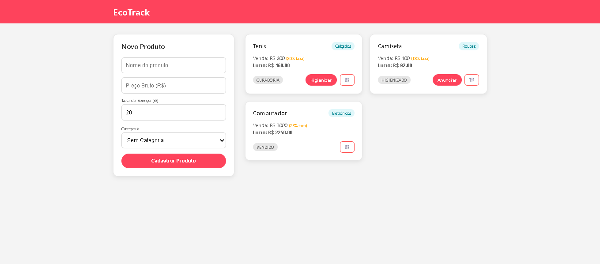
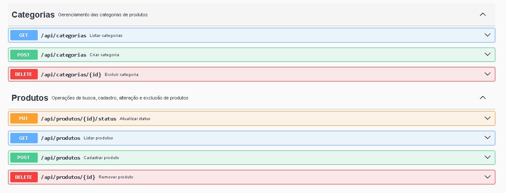

# EcoTrack - Gestão de Produtos Usados

O **EcoTrack** é uma solução FullStack desenvolvida para otimizar o gerenciamento de produtos em brechós parceiros ou para vendedores independentes. O foco do projeto é permitir que o usuário tenha controle total sobre o ciclo de vida de cada produto, garantindo uma operação organizada e eficiente.

## 📋 O Fluxo de Negócio
O sistema reflete as etapas reais do processo de revenda de itens usados (Economia Circular):

1.  **Curadoria:** Avaliação técnica da peça para verificar estado e viabilidade de venda.
2.  **Higienização:** Controle do processo de limpeza e pequenos reparos.
3.  **Anunciar:** Preparação do item para plataformas de venda.
4.  **Vendido:** Conclusão do ciclo, gerando baixa automática no sistema.

<p align="center">
  
</p>

## 🚀 Tecnologias Utilizadas

### Infraestrutura & Containerização
- **Docker & Docker Compose**: Orquestração completa do ambiente.
- **Nginx**: Servidor utilizado para servir o Frontend de forma otimizada.

### Backend
- **Java 17** com **Spring Boot 3**.
- **Spring Data JPA**: Para persistência e manipulação de dados.
- **MySQL 8.0**: Banco de dados relacional.
- **Maven**: Gerenciamento de dependências e automação de build.
- **Springdoc OpenAPI (Swagger)**: Documentação interativa da API.

### Frontend
- **HTML5 & CSS3**: Interface intuitiva e responsiva.
- **JavaScript (ES6+)**: Consumo de API REST utilizando **Fetch API**.

## 🛠️ Funcionalidades
- **CRUD Completo:** Criação, leitura, atualização e exclusão de itens.
- **Gestão de Status:** Atualização em tempo real da etapa do produto.
- **Ambiente Isolado:** Execução garantida via containers.

---

## 📖 Documentação da API (Swagger)

A API conta com documentação interativa completa. Com o sistema rodando, você pode testar todos os endpoints, verificar os modelos de dados e as descrições de cada operação:

🔗 **Link:** [http://localhost:8080/swagger-ui/index.html](http://localhost:8080/swagger-ui/index.html)

<p align="center">
  
</p>

---

## 🐳 Como Executar com Docker (Recomendado)

Este projeto está totalmente dockerizado, permitindo que você suba o Banco, o Backend e o Frontend com apenas um comando.

### Pré-requisitos
- [Docker Desktop](https://www.docker.com/products/docker-desktop/) instalado e rodando.

### Passo a Passo

1.  **Clone o repositório:**
    ```bash
    git clone https://github.com/rafuulll/ecotrack.git
    cd ecotrack
    ```

2.  **Gere o pacote do Backend (Skip Tests):**
   Acesse a pasta onde está o código-fonte e gere o arquivo `.jar` ignorando os testes unitários (que buscam banco externo):

    No Windows:
    ```bash
    ./mvnw.cmd clean package -DskipTests
    ```

    No Linux/Mac:
    ```bash
    ./mvnw clean package -DskipTests
    ```

3.  **Suba a aplicação completa:**
    Na raiz do projeto (onde está o arquivo `docker-compose.yml`), execute:
    ```bash
    docker compose up --build
    ```

4.  **Acesse o sistema:**
    - **Interface Web:** [http://localhost](http://localhost) (Porta 80)
    - **API Endpoints:** [http://localhost:8080/api/produtos](http://localhost:8080/api/produtos)

---

## 🔧 Configuração Manual (Desenvolvimento)

Caso prefira rodar fora do Docker:

1.  **Banco de Dados:** Certifique-se de que o MySQL está rodando e crie o schema `ecotrack`.
2.  **Backend:** Ajuste `backend/src/main/resources/application.properties` com suas credenciais e execute a classe `EcoTrackApplication`.
3.  **Frontend:** Abra o arquivo `frontend/index.html` em seu navegador.

---

### Contato
Desenvolvido por **Rafael Maschietto Mastromauro**
[LinkedIn](https://www.linkedin.com/in/rafael-maschietto-mastromauro-6632aa2b8/) | [E-mail](mailto:rafammastro@gmail.com)
